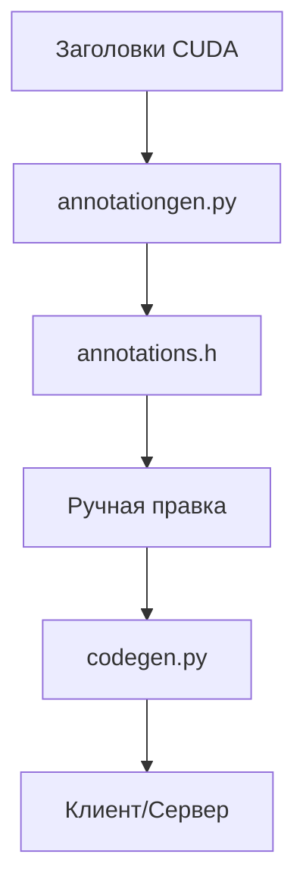

# GPUBridge: Система удалённого доступа к GPU через RPC

## 🛠 Архитектура кодогенерации
Реализована по принципу **human-in-the-loop** с двухэтапным процессом:

### 1. Этап аннотирования (`annotationgen.py`)
```python
# Пример аннотированной функции в annotations.h
/**
 * @param dest SEND_ONLY LENGTH:count  // Указатель назначения
 * @param src  RECV_ONLY LENGTH:count  // Источник данных
 * @param count SIZE:8                // Размер блока
 */
void cudaMemcpy(void* dest, const void* src, size_t count);
```

**Ключевые аннотации:**
| Аннотация           | Назначение                          | Пример использования         |
|---------------------|-----------------------------------|---------------------------|
| `SEND_ONLY`         | Только передача данных            | Указатели назначения       |
| `RECV_ONLY`         | Только приём данных               | Буферы источника          |
| `LENGTH:<param>`    | Динамический размер данных        | `LENGTH:count`            |
| `NULL_TERMINATED`   | Работа со строками                | Текстовые параметры       |

### 2. Этап генерации кода (`codegen.py`)
Генерирует:
- Клиентские RPC-стабы
- Серверные обработчики вызовов
- Сериализацию параметров



## 🔌 Почему собственный протокол?
**Сравнение с альтернативами:**

| Критерий          | GPUBridge       | Protobuf/GRPC   |
|-------------------|----------------|----------------|
| Производительность | ⚡ Прямой доступ к памяти | 🐢 Двойное копирование |
| Гибкость          | 🔧 Кастомная обработка | 🧩 Ограничения формата |
| Объём кода        | 🪶 Минимальный   | 🏗️ Требует .proto-файлов |

**Преимущества нашего решения:**
1. Нулевые накладные расходы при работе с:
   - Графическими буферами (`cudaArray_t`)
   - Потоками данных (`cudaStream_t`)
2. Поддержка сложных сценариев:
   ```c++
   // Специальная обработка для cudaMemcpy
   switch(kind) {
       case cudaMemcpyHostToDevice: //... 
       case cudaMemcpyDeviceToHost: //...
   }
   ```
